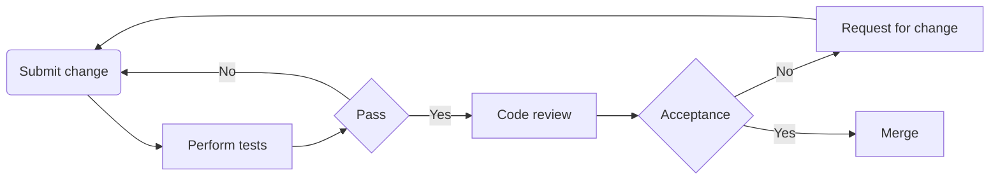

- [Summary](#summary)
- [Starting a New Project](#starting-a-new-project)
- [Development Workflow](#development-workflow)

## Summary 
The development process takes place after a product's functionalities and specifications are determined, and the development team's requirements to begin are arranged. These requirements may include designs or user flows, access to third-party services, etc. 

The development team's first step is to decide on the software's architecture and structure, and set up a development environment. Then, the implementation stage begins; how the team plans to proceed at this stage depends on multiple factors, such as the software's delivery method, business requirements and timeline.

The following sections will walk you through:
- Initial steps for starting a new project
- Development and maintenance workflow 

## Starting a New Project
The following are the initial steps you will need to take when starting a new project. Ideally, you will follow the steps as they are described below. However, depending on the project's timeline and other unpredictable circumstances, you might proceed differently or repeat steps as the project's plan and its requirements change. 

**1. Software architecture:**
The team arranges its requirements to start working on the project. The project's lead developer(s) will decide on the software architecture.

**2. Decide a tech stack:**
The project's lead developer will decide on a tech stack by taking the team's experience into account but generally should try to keep it as close as possible to [our preferred stack](/technology-stack.md).

**3. Adopt a branching strategy:**
The team will adopt a branching strategy based on the software's delivery method from the [Branching Strategy](/branching-strategy.md#strategies) document.

**4. Set up a development environment:**
The project's lead developer will assign a developer who most likely has the most experience with the chosen tech stack and branching strategy to set up a development environment. The developer will prepare the project's initial code and tools, and collaborates with the infrastructure team to set up the repository rules and CI/CD pipelines. 

## Development Workflow
This section only describes our development workflow abstractly; your project's branching strategy may introduce additional steps.

**1. Submit changes:**
Contributors will always submit their work through merge requests.

**2. Testing:**
Upon creating/updating a merge request, tests will be run against the changes to ensure they won't break anything and the software will build successfully. The request will go to the next step if it passes all the tests.

**3. Code review:**
The project's maintainer is responsible for reviewing merge requests and ensuring all the changes are aligned with our [contribution rules](/contribution-rules.md).

**4. Release/deploy:**
Managing releases and deployments is either automated or done manually by the project's maintainer(s) according to the project's branching strategy.
